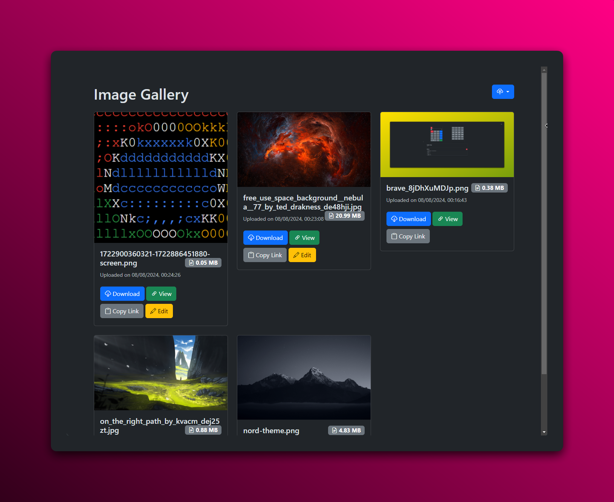

# Image Gallery

Image Gallery is a web application with a node.js backend. It allows users to upload, view, and manage their images in a gallery format. The application provides a user-friendly interface for organizing and showcasing images.


## Description

The Image Gallery project is a web application that allows users to upload, view, and manage their images in a gallery format. It provides a user-friendly interface for organizing and showcasing images.

## Features

- Upload images
- View images in a gallery format
- Organize images into albums
- Search images by tags
- Share images with others
- Delete images

## Installation

1. Clone the repository: `git clone https://github.com/EXELVI/Image_gallery.git`
2. Navigate to the project directory: `cd image-gallery`
3. Install dependencies: `npm install`
4. Create a `db.json` file in the project root directory with the following content:

    ```json
    {

    }
    ```

5. Create a `.env` file in the project root directory with the following content:

    ```env
    CLIENT_ID="YOUR_DISCORD_APP_CLIENT_ID"
    CLIENT_SECRET="YOUR_DISCORD_APP_CLIENT_SECRET"
    ```
6. Start the application: `npm start`

## Usage

1. Open your web browser and navigate to `http://localhost:3000`.
2. Sign in with your Discord account.
3. Upload images by clicking the "Upload" button.

## Features

- Upload images
- Download images
- Modify images (crop, rotate, resize, etc.)
- Copy link to clipboard


## Contributing

Contributions are welcome! If you have any ideas or suggestions, please open an issue or submit a pull request.
